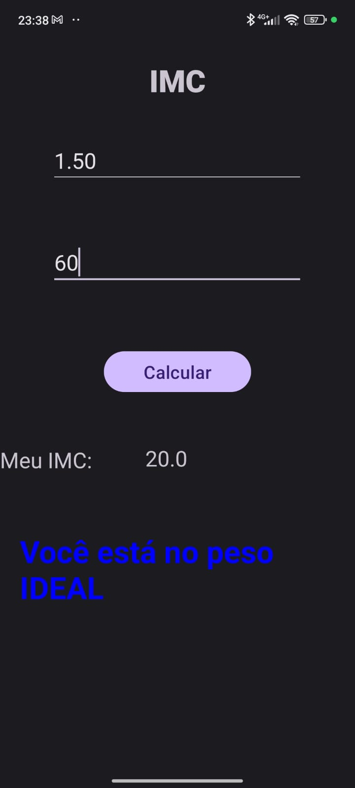
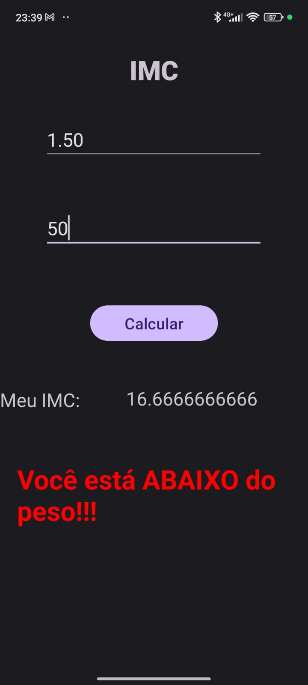
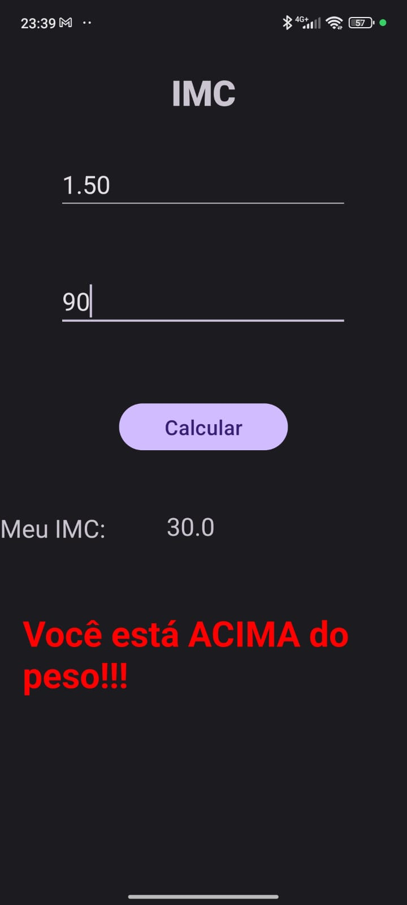

# Calculadora de Índice de Massa Muscular

## 📋 Descrição 
Projeto desenvolvido para a disciplina de Programação Mobile da Faculdade de Tecnologia Santana de Parnaíba (Fatec SBC).
 
O IMC é responsável por indicar o estado físico de uma pessoa, sendo que a pontuação é obtida por meio de um calculo matemático em que a altura é multiplicada por 2 e divido pelo peso. 

Quando a pontuação ficar entre 17,5 a 22,5, é considerado como peso ideal, já abaixo disso é considerado abaixo do peso, e acima de 22,5 é obesidade.

## 🖥️ Ferramentas Utilizadas

Linguagem de Programação Java 

Android Studio versão Ladybug Feature Drop 2024.2.2

## 📷 Imagens  

### 📝 Tela de entrada de dados  

  
    

  

---

### ✅ Tela com saída positiva  

  
    

  

---

### ⚠️ Tela com saída de peso abaixo do ideal  

  
    

  

---

### ⚠️ Tela com saída de peso acima do ideal  

  
    

  

